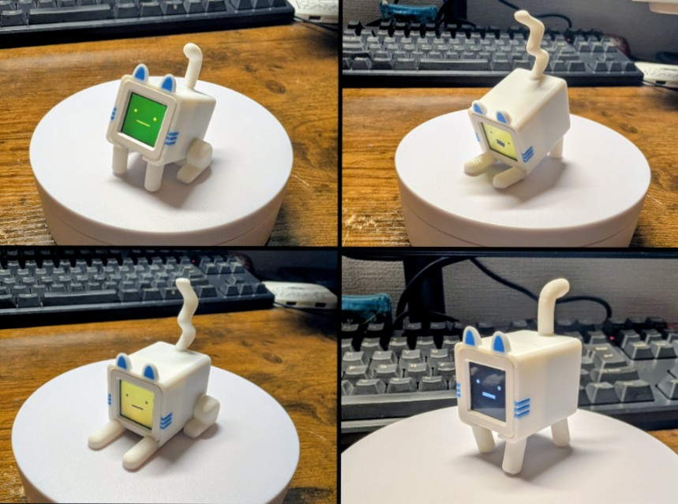
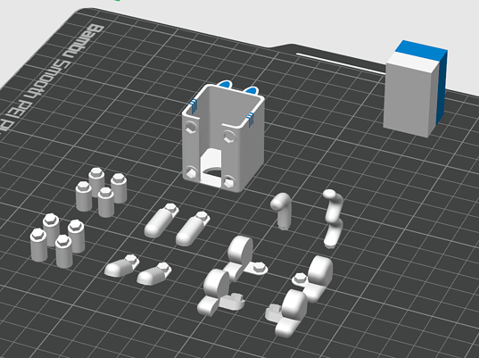

# atom-nyan (ver.u-tanick)

## What is it

This is "atom-nyan".

It is a little cute robot using M5Stack Atom.

original designed by aokko2000 (https://x.com/aokko2000).

In this version, it has been customized to allow swapping of legs and tail.

X hash-tag "#ｱﾄﾑﾆｬﾝ"

## How to build

Use M5Stack Atom Series Unit.

### HW: Parts Requirement

- AtomS3 or AtomS3R
  - https://docs.m5stack.com/ja/core/AtomS3
  - https://docs.m5stack.com/ja/core/AtomS3R

- Atomic Battery Base
  - https://docs.m5stack.com/ja/atom/Atomic%20Battery%20Base

### HW: Additional Parts

- NanoMIC
  - super micro mic module for Grove socket
  - https://washishi.booth.pm/items/7083594

### SW: For Atom LCD 

- m5stack-avatar-mic
  - A stack-chan avatar that can also be used with Atom, featuring lip-sync based on microphone audio input.
  - https://github.com/mongonta0716/m5stack-avatar-mic
  - if you want to use M5Burner
    - M5Burner > ATOMS3 > M5Stack-avatar-mic-atoms3

# 日本語

## これは何

M5Stack Atomを使ったカワイイ手乗りロボット "ｱﾄﾑﾆｬﾝ" 用のモデルです。

"ｱﾄﾑﾆｬﾝ"のオリジナルデザインは aokko2000 (https://x.com/aokko2000) さんです。

このバージョンでは、足と尻尾を付け替えられるようにカスタマイズしています。

Xのハッシュタグは "#ｱﾄﾑﾆｬﾝ" です。

## どうやって組み立てるの

顔の部分はM5Stack Atom シリーズを使用します。

### ハードウェア：必須

- AtomS3 or AtomS3R
  - https://docs.m5stack.com/ja/core/AtomS3
  - https://docs.m5stack.com/ja/core/AtomS3R

- Atomic Battery Base
  - https://docs.m5stack.com/ja/atom/Atomic%20Battery%20Base

### ハードウェア：オプション

- NanoMIC
  - Groveソケットに隠すように装着できる極小サイズのマイクモジュール
  - https://washishi.booth.pm/items/7083594

### SW: For Atom LCD 

- m5stack-avatar-mic
  - Atomでも使用できるｽﾀｯｸﾁｬﾝｱﾊﾞﾀｰ、マイク音声を拾って口パクします
  - https://github.com/mongonta0716/m5stack-avatar-mic
  - if you want to use M5Burner
    - M5Burner > ATOMS3 > M5Stack-avatar-mic-atoms3
