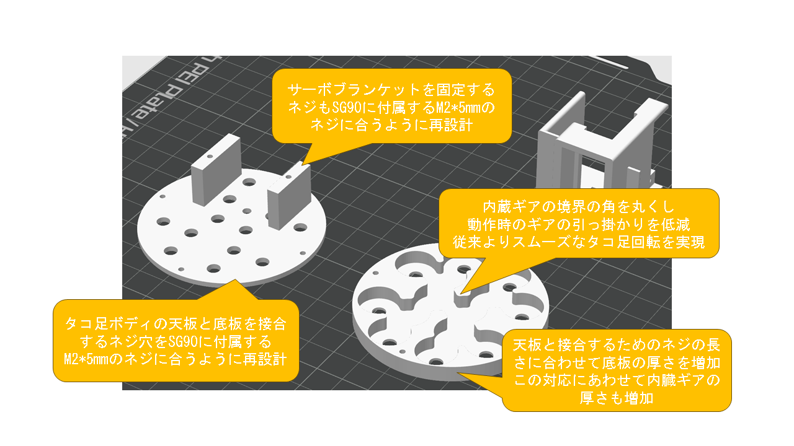

# ｽﾀｯｺﾁｬﾝ 3Dモデル v2

ネジ穴径や長さ(M2*5mm想定)と、足の抜けやすさを改良しました。

足は空回りしなくなりましたが、干渉するとロックしてサーボに
悪影響なので動作確認しながら安全な角度で取り付けてください。

隣り合う足の角度をずらして取り付けるのがよいと思います。

ネジは土台の固定に3本、サーボブラケットの固定に2本が必要です。

ｽﾀｯｸﾁｬﾝの顔部分については、従来品の流用も可能ですが、
参考までに3Dモデルにもヘッドシェルを含めています。

## 3Dプリンター印刷時のノウハウ

一般的なPLAフィラメントだと比較的問題ないと思われますが、マットPLAやシルクPLAなど特殊なフィラメントやPETGなどの場合、ギアの摩擦が強くなりうまく回転しない場合があります。

できれば普通のPLAで、それ以外の場合はギアを95-98%などに縮尺掛けるとすこしかみ合わせに余裕がでて回転してくれた、という報告をいただきました。

今回のモデルはギアと足の接合を六角軸で設計したのですが、ギアを縮小すると足の軸が入らなくなる可能性があるため、縮小する場合は足も同率に縮小するなど調整していただくのがよいと思います。

## 改良点

